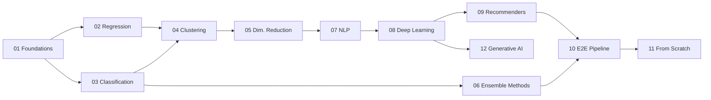

<p align="center">
  
  
  
  
  
  
  
  
</p>

# Machine Learning A-to-Z

> A comprehensive, hands-on repository covering the **entire Machine Learning & AI spectrum** — from foundational statistics through supervised/unsupervised learning, NLP, deep learning (ANN, CNN, RNN, LSTM, Transformers, GANs, Autoencoders, RL), recommendation systems, ensemble methods (XGBoost, LightGBM, CatBoost), model explainability (SHAP, LIME), **Generative AI (LangChain + OpenAI)**, to **production-grade end-to-end ML pipelines with MLflow, CI/CD, Docker, and AWS deployment**.

---

## Table of Contents

- [Overview](#overview)
- [Repository Structure](#repository-structure)
- [Topics Covered](#topics-covered)
- [Getting Started](#getting-started)
- [Project Highlights](#project-highlights)
- [Tech Stack](#tech-stack)
- [Contributing](#contributing)
- [License](#license)
- [Acknowledgements](#acknowledgements)
- [Author](#author)

---

## Overview

This repository is a curated collection of **70+ notebooks, scripts, and applications** spanning every major area of machine learning and AI. Each module is self-contained with theory, implementation, visualization, and real-world datasets.

### What makes this repo stand out?

| Feature | Details |
|---------|---------|
| **Breadth** | Covers **13 domains** — statistics to deep learning to Generative AI |
| **Depth** | Not just API calls — includes **from-scratch implementations** of core algorithms |
| **Practical** | Real datasets (healthcare, finance, e-commerce, NLP) with **Streamlit/Flask apps** |
| **Production-Ready** | E2E pipeline with **Flask + Docker + GitHub Actions CI/CD + AWS deployment** |
| **Generative AI** | LangChain + OpenAI MCQ Generator with Streamlit UI |
| **Theory + Practice** | 27 PDF theory notes organized by topic alongside hands-on code |
| **Templates** | Reusable classification & regression evaluation templates with hyperparameter configs |

---

## Repository Structure

```
Machine-Learning-A-to-Z/
│
├── 01_Foundations/                              # Core ML prerequisites
│   ├── Python_Essentials.ipynb                 # Python data structures & algorithms
│   ├── Pandas_Tutorial.ipynb                   # Pandas Series to advanced operations
│   ├── Hypothesis_Testing.ipynb                # Chi-Square, T-tests, Correlation
│   ├── Feature_Engineering_and_Selection.ipynb # Encoding, Scaling, RFE, Lasso
│   ├── Cross_Validation_Techniques.ipynb       # K-Fold, Stratified, Nested CV
│   ├── EDA_Masterclass.ipynb                   # ★ Complete EDA reference (distributions, outliers, correlations)
│   ├── Model_Explainability_SHAP_LIME.ipynb    # ★ SHAP, LIME, Permutation Importance, PDP
│   ├── Hyperparameter_Tuning_Guide.ipynb       # ★ GridSearch, RandomSearch, Optuna Bayesian
│   ├── Bias_Variance_Learning_Curves.ipynb     # ★ Learning curves, validation curves, model complexity
│   └── Python_Assignments/                     # 10 Q&A notebooks (NumPy, Pandas, OOP, SQLite, Generators)
│
├── 02_Regression/                              # Regression algorithms & projects
│   ├── Simple_Linear_Regression/               # Height vs Weight prediction
│   ├── Multiple_Linear_Regression/             # Economic index prediction
│   ├── Polynomial_Regression/                  # Degree comparison analysis
│   ├── Support_Vector_Regression/              # SVR implementation
│   ├── Algerian_Forest_Fire/                   # Forest fire area prediction
│   ├── Big_Mart_Sales/                         # Retail sales prediction
│   ├── Calories_Burnt_Prediction/              # XGBoost regression
│   ├── House_Price_Prediction/                 # Boston Housing with XGBoost
│   ├── Used_Cars_Price_Prediction/             # CarDekho ensemble regressors
│   └── Time_Series_ARIMA/                      # ARIMA forecasting & diagnostics
│
├── 03_Classification/                          # Classification algorithms & projects
│   ├── Logistic_Regression/                    # Synthetic data + ROC AUC analysis
│   ├── Decision_Tree/                          # Iris dataset classification
│   ├── KNN_Classification/                     # Optimal K, distance metrics, scaling
│   ├── Naive_Bayes/                            # Gaussian, Multinomial, Bernoulli NB
│   ├── SVM_Classification/                     # ★ All 4 kernels, C/Gamma tuning, decision boundaries
│   ├── Random_Forest/                          # Wine dataset, OOB, feature importance
│   ├── Diabetes_SVM_Prediction/                # SVM on diabetes dataset
│   ├── Heart_Disease_Prediction/               # Heart disease classification
│   ├── Holiday_Package_Prediction/             # Travel package prediction
│   ├── Loan_Approval_Prediction/               # XGBoost loan classification
│   ├── Rock_Vs_Mine/                           # Sonar data logistic regression
│   └── Imbalanced_Classification/              # SMOTE, over/under-sampling
│
├── 04_Clustering/                              # Unsupervised learning
│   ├── KMeans_Clustering/                      # make_blobs + Silhouette Score
│   ├── DBSCAN_Clustering/                      # Density-based on make_moons
│   ├── Hierarchical_Clustering/                # Agglomerative + PCA on Iris
│   ├── Customer_Segmentation/                  # Mall Customers K-Means
│   └── Anomaly_Detection/                      # ★ Isolation Forest, LOF, One-Class SVM
│
├── 05_Dimensionality_Reduction/                # Feature reduction techniques
│   ├── PCA_Analysis/                           # PCA on Breast Cancer dataset
│   └── tSNE_UMAP/                              # ★ PCA vs t-SNE vs UMAP comparison on digits
│
├── 06_Ensemble_Methods/                        # Advanced ensemble techniques
│   ├── Ensemble_Techniques.ipynb               # Bagging, Boosting, Stacking, Voting
│   └── Gradient_Boosting_XGBoost_LightGBM_CatBoost.ipynb  # ★ Head-to-head comparison
│
├── 07_NLP/                                     # Natural Language Processing
│   ├── Spam_Detection/                         # NLTK + TF-IDF text classification
│   └── Next_Word_Prediction/                   # LSTM on Sherlock Holmes text
│
├── 08_Deep_Learning/                           # Neural networks & deep learning
│   ├── ANN_Churn_Classification/               # ANN + Streamlit app (bank churn)
│   ├── ANN_Salary_Regression/                  # ANN regression + Streamlit app
│   ├── Neural_Network_Breast_Cancer/           # Dense NN classification
│   ├── MNIST_Digit_Classification/             # TensorFlow/Keras CNN
│   ├── CNN_Image_Classification/               # ★ CIFAR-10 Conv2D + BatchNorm + Data Augmentation
│   ├── SimpleRNN_IMDB_Sentiment/               # SimpleRNN + Streamlit app
│   ├── LSTM_Next_Word_Prediction/              # LSTM + Streamlit app (Hamlet)
│   ├── Word_Embeddings/                        # One-hot + Keras Embedding layers
│   ├── Image_Processing_for_DL/                # PIL, OpenCV, matplotlib.image
│   ├── Hybrid_Model_Stock_Prediction/          # Linear Regression + LSTM (Apple stock)
│   ├── DL_Regularization_Optimization/         # ★ Dropout, BatchNorm, L2, LR Scheduling
│   ├── Transfer_Learning/                      # ★ MobileNetV2 feature extraction vs fine-tuning
│   ├── Autoencoders/                           # ★ Vanilla AE, Denoising AE, VAE (MNIST)
│   ├── GANs/                                   # ★ Simple GAN + DCGAN (MNIST)
│   ├── Transformer_From_Scratch/               # ★ Self-attention, Multi-Head, Positional Encoding
│   └── Reinforcement_Learning/                 # ★ Q-Learning, DQN, GridWorld environment
│
├── 09_Recommendation_Systems/                  # Recommender engines
│   ├── Movie_Recommendation/                  # Content-based (TF-IDF + Cosine Similarity)
│   └── Collaborative_Filtering/                # ★ User-Based CF, Item-Based CF, SVD
│
├── 10_End_to_End_ML_Pipeline/                  # Production ML
│   ├── Student_Performance_Prediction/         # Full production pipeline
│       ├── app.py / application.py             # Flask web application
│       ├── Dockerfile                          # Docker containerization
│       ├── .github/workflows/main.yml          # CI/CD (GitHub Actions → AWS ECR)
│       ├── .ebextensions/                      # AWS Elastic Beanstalk config
│       ├── src/components/                     # Data ingestion, transformation, training
│       ├── src/pipeline/                       # Prediction pipeline
│       ├── notebook/                           # EDA & model experimentation
│       └── templates/                          # HTML templates
│   └── MLflow_Experiment_Tracking/              # ★ MLflow logging, model registry, experiment comparison
│
├── 11_From_Scratch_Implementations/            # Algorithms without libraries
│   ├── Linear_Regression.py                    # Gradient descent implementation
│   ├── Logistic_Regression.py                  # Sigmoid + gradient descent
│   └── SVM.py                                  # Hinge loss + gradient descent
│
├── 12_Generative_AI/                           # Gen AI & LLM applications
│   └── MCQ_Generator/                          # LangChain + OpenAI MCQ generator
│       ├── StreamlitAPP.py                     # Streamlit UI (upload PDF → MCQs)
│       ├── src/mcqgen/                         # Sequential LLM chain modules
│       ├── experiment/mcq.ipynb                # LangChain experimentation
│       └── .env.example                        # API key template
│
├── Notes/                                      # Theory reference PDFs (27 files)
│   ├── Statistics_and_Probability/             # 18 PDFs: distributions, correlation, probability
│   ├── ML_Theory/                              # 4 PDFs: LR, SVR, Naive Bayes, clustering
│   └── Deep_Learning_Theory/                   # 5 PDFs: DL fundamentals, LSTM, GRU, Transformers, Attention
│
├── Templates/                                  # Reusable ML templates
│   ├── Classification_Template.py              # Multi-model classifier evaluation
│   ├── Regression_Template.py                  # Multi-model regressor evaluation
│   ├── classifier_hyperparameters.json         # Hyperparameter grids (9 classifiers)
│   └── regressor_hyperparameters.json          # Hyperparameter grids (8 regressors)
│
├── requirements.txt
├── .gitignore
├── LICENSE
└── README.md
```

---

## Topics Covered

### Learning Path (Recommended Order)



### Coverage Matrix

| Domain | Algorithms / Topics | Projects |
|--------|-------------------|----------|
| **Foundations** | Python, Pandas, Hypothesis Testing, Feature Engineering, Cross Validation, EDA, SHAP/LIME, Hyperparameter Tuning, Bias-Variance | 9 notebooks |
| **Regression** | Simple LR, Multiple LR, Polynomial LR, SVR, Lasso, Ridge, ElasticNet, XGBoost, ARIMA | 10 projects |
| **Classification** | Logistic Regression, Decision Tree, KNN, Naive Bayes, SVM (all kernels), Random Forest, XGBoost | 12 projects |
| **Clustering** | K-Means, DBSCAN, Hierarchical (Agglomerative), Anomaly Detection (IF, LOF, OCSVM) | 5 projects |
| **Dim. Reduction** | PCA, t-SNE, UMAP | 2 projects |
| **Ensemble** | Bagging, Random Forest, AdaBoost, Gradient Boosting, XGBoost, LightGBM, CatBoost, Voting, Stacking | 2 notebooks |
| **NLP** | TF-IDF, NLTK, Text Classification, LSTM Language Model | 2 projects |
| **Deep Learning** | ANN, Dense NN, CNN (CIFAR-10), SimpleRNN, LSTM, Word Embeddings, Transfer Learning, Autoencoders, VAE, GANs, DCGAN, Transformer, Reinforcement Learning (Q-Learning, DQN), Regularization & Optimization | 16 projects |
| **Recommenders** | Content-Based Filtering, Collaborative Filtering (User/Item CF, SVD), Cosine Similarity | 2 projects |
| **Production** | Flask, Docker, GitHub Actions CI/CD, AWS Elastic Beanstalk, MLflow Experiment Tracking, Logging | 2 projects |
| **From Scratch** | Linear Regression, Logistic Regression, SVM (gradient descent) | 3 implementations |
| **Generative AI** | LangChain, OpenAI GPT, Sequential Chains, Prompt Engineering | 1 project |
| **Theory Notes** | Statistics, Probability, ML Theory, Deep Learning Theory | 27 PDF references |

---

## Getting Started

### Prerequisites

- Python 3.8+
- pip or conda

### Installation

```bash
# Clone the repository
git clone https://github.com/SanjaySundarMurthy/MachineLearning-E2E.git
cd MachineLearning-E2E

# Create virtual environment
python -m venv .venv

# Activate (Windows)
.venv\Scripts\activate

# Activate (macOS/Linux)
source .venv/bin/activate

# Install dependencies
pip install -r requirements.txt
```

### Quick Start

```bash
# Start with fundamentals
jupyter notebook 01_Foundations/Pandas_Tutorial.ipynb

# Jump to a specific project
jupyter notebook 03_Classification/Random_Forest/Random_Forest_Classification.ipynb

# Run the E2E Flask app
cd 10_End_to_End_ML_Pipeline/Student_Performance_Prediction
pip install -r requirements.txt
python app.py

# Run a Deep Learning Streamlit app
cd 08_Deep_Learning/ANN_Churn_Classification
streamlit run app.py

# Try the Generative AI MCQ Generator
cd 12_Generative_AI/MCQ_Generator
cp .env.example .env   # Add your OpenAI API key
pip install -r requirements.txt
streamlit run StreamlitAPP.py
```

---

## Project Highlights

### End-to-End ML Pipeline (Student Performance Prediction)
A production-grade ML project predicting student math scores:
- **Modular architecture**: Data ingestion → Transformation → Model Training → Prediction
- **9 regression models** compared with GridSearchCV
- **Flask web app** with prediction form
- **Docker containerization** + **GitHub Actions CI/CD** pipeline
- **AWS Elastic Beanstalk** deployment configuration
- **Custom logging & exception handling**

### Deep Learning Suite (16 Projects)
Comprehensive neural network coverage:
- **ANN Churn Classification**: Bank customer churn prediction with Streamlit app
- **ANN Salary Regression**: Salary prediction with regression ANN + Streamlit
- **CNN Image Classification**: CIFAR-10 with Conv2D, BatchNorm, Data Augmentation
- **SimpleRNN IMDB Sentiment**: Sentiment analysis with Streamlit deployment
- **LSTM Next Word Prediction**: Hamlet-trained language model with Streamlit
- **Word Embeddings**: One-hot encoding vs Keras Embedding layers
- **MNIST Digit Classification**: CNN with TensorFlow/Keras
- **Hybrid Model**: Linear Regression + LSTM for Apple stock prediction
- **Transfer Learning**: MobileNetV2 feature extraction vs fine-tuning
- **Autoencoders & VAE**: Vanilla, Denoising, Variational Autoencoders on MNIST
- **GANs & DCGAN**: Generative Adversarial Networks for image generation
- **Transformer From Scratch**: Self-attention, Multi-Head Attention, Positional Encoding
- **Reinforcement Learning**: Q-Learning + DQN on custom GridWorld
- **DL Regularization**: Dropout, BatchNorm, L2, Learning Rate Scheduling comparison

### MCQ Generator (Generative AI)
LangChain + OpenAI powered application:
- **Upload any PDF** → automatically generates multiple-choice questions
- Sequential LLM chains for question generation and evaluation
- **Streamlit** web interface with customizable difficulty and subject

### Movie Recommendation System
Content-based recommendation engine:
- Processes TMDB 5000 movie dataset
- TF-IDF vectorization + Cosine Similarity
- Interactive **Streamlit** web application

### From-Scratch Implementations
Core ML algorithms implemented using only NumPy:
- **Linear Regression**: Gradient descent optimization
- **Logistic Regression**: Sigmoid activation + binary cross-entropy
- **SVM**: Hinge loss with gradient descent

---

## Tech Stack

| Category | Technologies |
|----------|-------------|
| **Core** | Python, NumPy, Pandas, Matplotlib, Seaborn, SciPy |
| **ML** | scikit-learn, XGBoost, LightGBM, CatBoost, statsmodels, Optuna |
| **Deep Learning** | TensorFlow, Keras |
| **Explainability** | SHAP, LIME |
| **NLP** | NLTK, TF-IDF |
| **Generative AI** | LangChain, OpenAI GPT, LLM Chains |
| **Image Processing** | OpenCV, PIL/Pillow |
| **Visualization** | UMAP, t-SNE, Seaborn, Matplotlib |
| **Deployment** | Flask, Streamlit |
| **MLOps** | MLflow, Docker, GitHub Actions CI/CD, AWS Elastic Beanstalk |
| **RL** | Gymnasium (OpenAI Gym) |
| **Data** | CSV, Pickle, JSON |

---

## Contributing

Contributions are welcome! Here's how:

1. Fork the repository
2. Create a feature branch (`git checkout -b feature/new-algorithm`)
3. Commit your changes (`git commit -m 'Add XYZ algorithm'`)
4. Push to the branch (`git push origin feature/new-algorithm`)
5. Open a Pull Request

### Contribution Ideas
- [ ] Add RAG (Retrieval-Augmented Generation) project
- [ ] Add unit tests for from-scratch implementations
- [ ] Add Weights & Biases integration
- [ ] Add advanced NLP with Hugging Face Transformers
- [ ] Add time-series forecasting with Prophet

---

## License

This project is licensed under the MIT License — see the [LICENSE](LICENSE) file for details.

> **Educational Use Disclaimer:** The concepts, techniques, and project ideas in this repository are based on learnings from **Udemy MLOps / Machine Learning bootcamp courses**. All code has been written, adapted, and extended by the author for personal learning and reference. This repository is intended for **educational purposes only** and is not affiliated with or endorsed by Udemy or the course instructors.

---

## Acknowledgements

This repository was built as part of the learning journey through various **Udemy courses**, including:

- **Machine Learning & MLOps Bootcamp** — Core ML algorithms, end-to-end pipelines, deployment strategies
- **Deep Learning & Neural Networks** — ANN, CNN, RNN, LSTM, Transformers, GANs
- **NLP & Generative AI** — Text processing, LangChain, OpenAI integration

Special thanks to the **Udemy instructors and community** whose course content provided the foundational knowledge and project inspiration for this work.

> _All implementations, extensions, additional projects, and documentation are original work by the author._

---

## Author

**Sanjay S**  
- Email: sanjaysundarmurthy@gmail.com  
- LinkedIn: [Connect with me](https://linkedin.com/in/sanjay-s-094586160)  

---

<p align="center">
  <b>If you found this helpful, please ⭐ this repository!</b>
</p>
